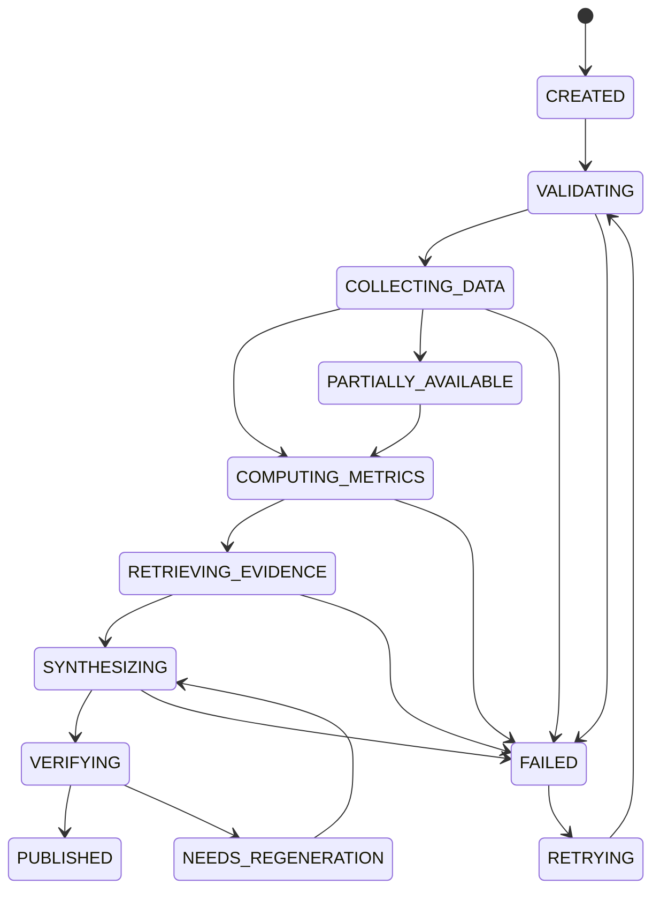

# Agent 工作流架构

- Status: Accepted
- Owner: Project
- Last reviewed: 2026-09-23
- Scope: 定义研究任务的受控执行、计划、工具契约、状态、重试和质量门禁；不定义领域聚合内部结构或具体 Prompt 文本。
- Related ADRs: ADR-0001

## 1. 执行原则

系统采用受控工作流与 Agent 节点组合，而不是完全自由的循环式 Agent，也不在第一版引入角色扮演式多 Agent。

- 程序控制阶段、依赖、最大调用次数、超时、重试和发布条件。
- 模型只参与意图识别、结构化计划、语义检索判断、综合分析和表达。
- 每个模型节点都有强类型输入、输出 Schema、工具白名单和 Token 预算。
- 证券、日期、数据权限、历史时点和行业模板由程序校验。
- 确定性计算、核心数字、引用和质量门禁不能由模型自行决定。
- 多 Agent 只有在固定评测证明质量收益覆盖成本和复杂度后才通过新 ADR 引入。

## 2. 任务类型

| 任务类型 | 执行模式 | 目标时延 | 说明 |
| --- | --- | --- | --- |
| `QUICK_DATA_QUERY` | 同步 | 5～15 秒 | 单个事实、指标或公告 |
| `REPORT_FOLLOW_UP` | 同步或短异步 | 10～30 秒 | 绑定报告版本和证据 |
| `COMPARATIVE_ANALYSIS` | 短异步 | 20～60 秒 | 公司快速比较 |
| `BOOTSTRAP_RESEARCH` | 异步 | 2～5 分钟起 | 首次完整研究 |
| `FULL_RESEARCH` | 异步 | 2～5 分钟起 | 完整公司报告 |
| `DAILY_REFRESH` | 定时后台 | 交易日 | 快照与增量 |
| `WEEKLY_DIGEST` | 定时后台 | 每周 | 趋势聚合 |
| `MONTHLY_BASELINE` | 定时后台 | 每月 | 完整基线 |
| `EVENT_RESEARCH` | 事件触发 | 按等级 | 重大事件验证 |
| `REPORT_REVISION` | 异步 | 按影响范围 | 用户批准后的修订 |

飞书的长任务立即返回任务受理、`researchRunId` 和进度入口，不能保持 Webhook 等待完整研究。

## 3. 结构化分析计划

模型生成受 Schema 约束的 `AnalysisPlan`，程序验证后才执行。

| 字段 | 约束 |
| --- | --- |
| `securityId` | 必须解析为有效证券 |
| `taskType` | 使用系统枚举 |
| `asOfTime` | 创建后不可静默改变，不能超出当前可用时间 |
| `financialHistoryYears` | 第一版通常为 3～5 年，受数据权限限制 |
| `valuationWindow` | 有明确起止和复权口径 |
| `includePeers` | 同行由规则生成候选 |
| `includeDisclosures` / `includeNews` | 受任务类型和时间范围约束 |
| `industryTemplate` | 必须与公司分类相容 |
| `sections` | 来自允许的报告章节集合 |
| `budgets` | 模型调用、Token、工具调用和总时限上限 |

校验器检查证券、日期、未来数据、行业模板、查询规模、Tushare 权限和预算。模型不能绕过计划直接调用底层数据库或供应商接口。

## 4. 研究状态机



每个阶段记录开始与结束时间、输入版本、输出产物、状态原因和失败分类。状态迁移由 Spring Boot 应用服务执行，n8n 和模型只能发起命令。

## 5. 工具分层与契约

### 身份与基础信息

`resolveSecurity`、`getCompanyProfile`、`selectPeerGroup`

### 数据获取

`getFinancialStatements`、`getFinancialIndicators`、`getMarketHistory`、`getValuationHistory`、`getDisclosures`、`getCompanyNews`

### 确定性分析

`calculateFinancialTrends`、`calculateCashFlowQuality`、`calculateValuationPercentile`、`compareWithPeers`、`detectFinancialAnomalies`、`buildScenarioValuation`

### RAG 检索

`searchReportEvidence`、`searchRiskEvidence`、`searchManagementExplanation`、`searchEventEvidence`

### 报告与质量

`generateReportSection`、`validateNumbers`、`validateCitations`、`validateReportCompleteness`、`publishReport`

所有工具契约都必须包含：

- 强类型参数、结果和错误枚举；
- `asOfTime`、来源、数据时间、版本和完整度；
- 幂等键与调用追踪信息；
- 授权范围、超时、重试类别和结果大小限制；
- 对模型隐藏 SQL、内部表名、凭据和供应商原始错误。

独立数据获取可以并行；写操作和发布操作必须串行通过领域命令。

## 6. Agent 节点输入输出

每个 Agent 节点接收 `NodeContext`：

```text
researchRunId
nodeId
taskType
analysisPlanVersion
asOfTime
allowedTools
structuredInputs
evidenceRefs
promptVersion
modelPolicy
tokenBudget
deadline
```

节点只输出 Schema 化 `NodeResult`：

```text
status
structuredOutput
artifactRefs
citationRefs
warnings
missingInformation
usage
recommendedNextAction
```

输出先经过 Schema、枚举、日期、数字来源和引用校验，再成为 `ResearchArtifact`。自由文本不能直接改变任务状态或发布报告。

## 7. 审批、重试与恢复边界

- 网络超时、限流和临时供应商错误按退避策略自动重试。
- 参数非法、权限不足和证据不足不做盲目重试。
- 同一节点使用 `researchRunId + nodeId + inputVersion` 作为幂等边界。
- 章节验证失败只重新生成受影响章节，再执行跨章节一致性检查。
- 连续失败进入人工检查，不无限循环调用模型。
- 暂停、取消、用户批准和指定节点重试记录为 `HumanIntervention`。
- 恢复从持久化节点和产物开始，不能依赖 n8n 的临时运行内存。
- 已发布版本不在原地修改；重新生成产生新版本或修订版本。

## 8. 质量门禁

发布前至少执行：

1. 主体与证券一致性；
2. 分析截止时间和未来数据检查；
3. 核心数字存在于结构化输入或确定性计算；
4. 高重要度结论具有有效 Citation；
5. 引用指向存在的文档版本和页码；
6. 章节完整、跨章节数字和结论一致；
7. 证据强度达到该观点状态的最低门槛；
8. 不包含个性化仓位或确定性交易指令；
9. Prompt 注入和敏感信息输出检查；
10. 成本和调用次数没有越过硬预算。

硬门禁失败时不能发布正式观点。可降级项必须在报告和控制台中明确显示。

## 9. 幂等性与审计事件

- 创建任务使用渠道消息 ID 或客户端请求 ID 作为幂等键。
- Tushare 同一接口、参数、业务日期和版本在有效缓存期内不重复拉取。
- PDF 以来源标识、版本和文件哈希去重。
- 通知使用事件指纹和渠道作为去重键。
- 每个节点变化写入不可变 `ExecutionEvent`。
- 每次模型调用记录模型、Prompt、输入上下文哈希、工具、Token、费用、延迟和校验结果。
- 每个产物通过 `LineageEdge` 连接输入数据、证据、计算、节点和报告章节。
- Outbox 事件与领域状态在同一事务提交，消费者按事件 ID 幂等处理。

领域对象见 [领域模型](domain-model.md)，系统职责见 [系统架构总览](system-overview.md)。
