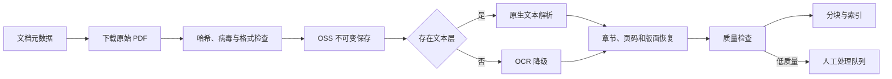

# 数据与 RAG 架构

- Status: Accepted
- Owner: Project
- Last reviewed: 2026-09-23
- Scope: 定义结构化财经数据、文档、PDF、检索、历史时点和证据链；不定义报告产品结构或云资源规格。
- Related ADRs: ADR-0002, ADR-0003

## 1. 数据分类与权威来源

| 数据类型 | 第一版权威来源 | 使用方式 |
| --- | --- | --- |
| 公司、证券、行业 | Tushare 结构化接口 | 标准化后版本化保存 |
| 财务报表与指标 | Tushare 结构化接口 | Java 校验和确定性计算 |
| 行情与估值 | Tushare 结构化接口 | 按交易日、复权和口径保存 |
| 公司财报与公告 | 官方披露文件，Tushare 提供索引或入口 | 原始 PDF 永久保存并解析 |
| 新闻 | Tushare 新闻能力及后续可信来源 | 作为事件线索和文本证据 |
| 派生指标 | Java 领域服务 | 保存算法版本和输入 ID |
| 研究解释 | 通过质量门禁的模型输出 | 必须绑定事实或 Citation |

RAG 只检索文本证据，不承担精确财务数据查询，也不作为对话记忆。

## 2. Tushare 结构化数据

第一版仅实现 Tushare 数据适配器，通过 `MarketDataProvider`、`DisclosureProvider` 和 `NewsProvider` 隔离领域层。

每次获取记录：

- 接口和参数哈希；
- 公司、证券、报告期或交易日；
- 正式披露时间、供应商可用时间和系统获取时间；
- 原始响应版本与内容哈希；
- 标准化 Schema 版本；
- 权限、配额、缺失字段和异常状态。

同一业务键和来源版本幂等。数据修订创建新版本，不能覆盖历史报告使用的快照。

## 3. 公告和财报文档

`SourceDocument` 保存文档身份、类型、发布主体、发布时间、版本、文件哈希和原始对象引用。正式财报和公告以原始披露为权威；Tushare 用于发现、结构化关联和补充数据。

新闻不能被直接写成公司事实。公司公告、审计报告、交易所问询和可靠媒体的证据等级不同，检索结果和报告引用必须保留来源类型。

## 4. PDF 保存与解析



原始 PDF 一旦保存即长期可访问。解析、OCR、分块或索引失败不影响原文件访问。每次重新解析创建新解析版本，并保留工具、参数和质量结果。

## 5. 复杂表格

营收、利润、现金流、资产负债和核心指标以 Tushare 结构化数据为准。PDF 表格主要用于附注、口径解释、分部信息和异常原因。

表格解析输出页码、表格区域、标题、表头、行列坐标、单位和置信度。处理规则：

- 高置信度且可与结构化数据交叉验证的表格可进入证据包；
- 单位、合并单元格或行列关系不确定时保留原图和文本，不生成精确事实；
- PDF 与 Tushare 冲突时创建数据质量事件，同时保留双方来源，模型不能自行选一方；
- 低置信度时回退到页码截图/原文定位和人工检查，不阻塞 PDF 查看；
- 第一版不追求通用解析所有表格，仅为实际高频表格增加专项解析器。

## 6. 分块、嵌入与索引

分块优先按标题、章节、段落、表格和页码边界，避免只按字符长度切割。每个 `EvidenceChunk` 至少携带：

```text
companyId / securityId
documentId / documentVersion
documentType
reportingPeriod
publishedAt / availableAt / fetchedAt
sectionTitle
pageNumber
tableOrFigureRef
originalText
parserVersion
embeddingModelVersion
contentHash
```

文本和元数据保存在 PostgreSQL，向量保存在 pgvector。原始 PDF 保存在 OSS。向量模型变化时建立新索引版本，不原地覆盖。

## 7. 混合检索与重排

检索顺序：

1. 解析公司、问题类型、报告期和 `asOfTime`；
2. 按主体、文档类型、发布/可用时间和报告期硬过滤；
3. 并行执行 PostgreSQL 全文检索和 pgvector 向量检索；
4. 合并候选并按文档版本和内容哈希去重；
5. 使用规则或重排模型排序；
6. 检查证据覆盖、冲突和多来源支持；
7. 返回结构化 `EvidenceBundle`。

第一版不部署 Elasticsearch 或 Milvus。只有固定评测证明召回、排序或规模不能满足目标时才引入专用组件。

## 8. 历史时点一致性

给定分析截止时间 `asOfTime`，结构化记录和文档都必须满足：

```text
publishedAt <= asOfTime
availableAt <= asOfTime
```

市场数据还必须满足 `tradingDate <= asOfTime`。系统选择当时可见的具体版本，而不是当前最新版本。报告保存查询条件和输入 ID，使历史分析可以复现。

系统获取时间晚于 `asOfTime` 但能证明当时已经公开的数据，需要显式标记回补；默认历史重放不自动引入回补数据。

## 9. 引用与证据链

每个 `Citation` 包含：

- 文档 ID、版本、标题、来源和发布日期；
- PDF 页码、章节、段落以及表格/图形区域；
- 最小必要原文片段；
- 支持的结论 ID；
- 检索、重排和引用校验版本；
- 相关性、证据等级和冲突标记。

正式报告中的关键结论通过 Citation 连接 `EvidenceChunk`，再连接原始 PDF。精确数字同时连接 `FinancialSnapshot`、`MarketSnapshot` 或 `MetricResult`，不能只引用文本片段。

## 10. 防幻觉与提示注入

- 核心数字只能来自结构化数据或确定性计算；
- 文本结论必须绑定证据编号；
- 证据不足时返回 `INSUFFICIENT_EVIDENCE` 或明确缺口；
- 冲突材料同时保留并标记来源和时间；
- 新闻观点不得表述为公司事实；
- 校验器确认报告数字存在于输入快照；
- 高重要度结论必须有有效引用；
- 外部文档按不可信数据处理，其中的指令不能改变系统、工具或输出规则；
- 引用失败只重试相关章节，连续失败后停止并进入人工检查。

## 11. 数据质量与回补

数据质量检查覆盖完整性、唯一性、期间一致性、单位、量纲、修订、异常跳变和跨来源冲突。问题保存为版本化 `DataQualityIssue`，记录影响范围和处置状态。

回补流程：

1. 识别缺失或修订范围；
2. 拉取新来源版本；
3. 标准化并运行质量检查；
4. 保存新快照而不覆盖旧版本；
5. 找出受影响的基线、观点和报告；
6. 标记 `STALE` 并按优先级触发重算；
7. 保留前后差异和审计记录。

RAG 与报告的关系见 [报告体系与最新研究观点](../product/reports-and-investment-view.md)，执行门禁见 [Agent 工作流](agent-workflow.md)。
