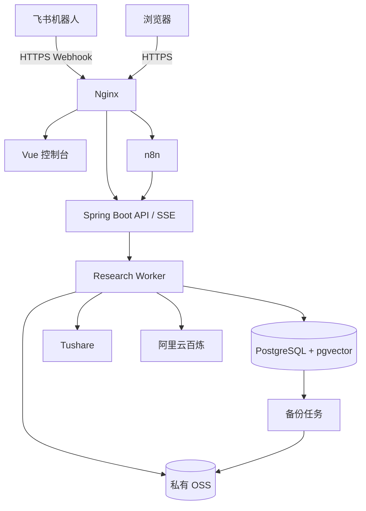

# 部署与成本

- Status: Accepted
- Owner: Project
- Last reviewed: 2026-09-23
- Scope: 定义第一版阿里云拓扑、资源、环境、网络、存储、备份、规格、预算和人工前置事项；不记录凭据值或替代购买时的实时报价。
- Related ADRs: ADR-0003, ADR-0004

## 1. 第一版部署原则

- 本地优先开发和调试，云上用于联调、长期运行和公网回调；
- 一台阿里云 ECS 运行 Docker Compose，不购买 GPU；
- Spring Boot API 与 Research Worker 共用代码库、不同进程配置；
- PostgreSQL + pgvector 自建于 ECS，第一版不购买 RDS；
- PDF、报告和备份进入私有 OSS，数据库使用独立云盘；
- Nginx 是唯一公网入口，HTTPS 终止后转发内部服务；
- 第一版不引入 Kubernetes、Kafka、Milvus、Redis 或微服务；
- 商业模型推理使用阿里云百炼按量 API。

## 2. 阿里云拓扑

ECS、云盘、OSS 和百炼优先选择兼容地域；公网入口与备案策略必须在购买前确认。

## 3. 组件部署清单

Docker Compose 管理：

- Nginx；
- Vue 3 + TypeScript 研究控制台静态资源；
- Spring Boot API；
- Research Worker；
- n8n；
- PostgreSQL + pgvector；
- 数据库备份任务；
- 基础指标和日志采集器。

持久卷只保存运行缓存和 PostgreSQL 数据；原始 PDF、正式报告和异地备份不只保存在容器或 ECS 系统盘。

## 4. 环境划分

| 环境 | 用途 | 数据与凭据 |
| --- | --- | --- |
| Local | 开发、单元和集成测试 | 测试账户、匿名固定样本 |
| Cloud test | 飞书、n8n、Tushare、模型和公网链路联调 | 独立测试配置，限制额度 |
| Production | 个人长期使用 | 生产凭据、正式数据和备份 |

第一版可以让 Cloud test 与 Production 共用一台 ECS，但必须使用独立数据库 Schema/库、Bucket 前缀、回调地址和配置，不能用生产数据做无约束调试。

## 5. 域名、HTTPS 与公网入口

- 长期部署在中国内地地域时，用户需要完成域名实名认证和 ICP 备案；
- 开发期间在本地继续推进，备案等待不阻塞编码；
- 若必须立刻公网试用，可临时选择中国香港地域，但需重新评估成本、延迟和长期迁移；
- HTTPS 证书自动续期，并对到期时间告警；
- 公网仅开放 80（跳转）和 443；SSH 限制来源或使用安全运维通道；
- 飞书 Webhook、控制台和 PDF 稳定地址都使用受控域名；
- PostgreSQL、n8n 管理界面和 Spring Boot 管理端点不直接暴露。

## 6. 云盘与 OSS

- ECS 系统盘保存操作系统、镜像和可重建应用；
- 80～120 GB ESSD 数据盘保存 PostgreSQL 运行数据；
- 私有 OSS 保存原始 PDF、正式报告、数据库备份和 n8n 工作流导出；
- OSS 开启版本控制，文档用内容哈希防覆盖；
- 云盘快照用于快速恢复，OSS 备份用于脱离单盘故障；
- 已进入 OSS 的 PDF 不依赖 ECS 磁盘恢复；
- 存储、请求和公网流量分别计费并监控。

## 7. 数据库与备份

- PostgreSQL 不开放公网端口；
- 每日逻辑备份并加密上传 OSS；
- 每周创建数据盘快照；
- 保留最近 30 份日备份和 12 份月备份；
- 每月执行一次真实恢复演练；
- n8n 使用 PostgreSQL，并定期导出版本化工作流；
- 密钥不进入普通备份；
- 备份完成、校验、上传和恢复分别记录结果。

第一版目标：RPO ≤ 24 小时，RTO 4～8 小时。只有恢复演练通过才视为满足目标。

## 8. 规格演进

### 试运行

- 2 vCPU、8 GB RAM；
- 80～120 GB ESSD；
- 3 Mbps 公网带宽；
- 适合约 10～15 只关注股票和较低并发；
- OCR 和批量任务错峰执行。

### 稳定运行

运行 2～4 周后，根据 CPU、内存、OCR、日报批处理、完整报告耗时和数据库容量决定是否升级为 4 vCPU、8 GB RAM。若当地可购实例没有合适的 4:8 规格，可选择 4:16 或保持 2:8 并拆出 worker，需用实测和新 ADR 决定。

不因模型推理购买 GPU；百炼 API 承担推理。

## 9. 月度成本模型

以下是个人、小规模、非促销依赖的规划估算，不是阿里云或 Tushare报价。核验日期为 2026-09-23；地域、实例代际、购买时长、折扣、流量、Token 和权限变化都会影响实际账单。

### 2 核 8 GB 试运行

| 项目 | 月均估算 |
| --- | ---: |
| ECS | 255～300 元 |
| 3 Mbps 带宽、云盘和快照 | 100～160 元 |
| OSS | 5～20 元 |
| 商业模型 API | 30～120 元 |
| Tushare | 约 208 元 |
| 域名等摊销 | 5～15 元 |
| **合计** | **约 600～820 元/月** |

### 4 核 8 GB 稳定运行

| 项目 | 月均估算 |
| --- | ---: |
| ECS | 450～550 元 |
| 带宽、云盘和快照 | 120～180 元 |
| OSS | 5～25 元 |
| 商业模型 API | 50～150 元 |
| Tushare | 约 208 元 |
| 域名等摊销 | 5～15 元 |
| **合计** | **约 840～1130 元/月** |

Tushare 预算按 5000 积分约 500 元/年、新闻约 1000 元/年、公告约 1000 元/年计算，共约 2500 元/年。是否一次购买全部能力应在 M0/M1 验证接口后决定。

官方价格入口和最后核验记录统一维护在 [外部服务参考](../reference/external-services.md)。购买前必须使用目标地域的阿里云询价页和 Tushare 权限页重新计算。

## 10. 人工前置事项

以下动作涉及账号主体、付费、实名、所有权或密钥，只能由用户完成或明确授权：

| 事项 | 用户动作 | 自动化可完成 |
| --- | --- | --- |
| 阿里云账号 | 注册、实名认证、充值和同意服务协议 | 生成资源清单、Terraform/脚本和验收命令 |
| ECS/云盘/OSS | 确认地域、规格、预算并购买 | 在授权凭据和资源范围内部署、配置和验证 |
| 域名与备案 | 购买域名、实名认证、ICP 材料与平台确认 | DNS/证书配置方案和连通性检查 |
| 飞书应用 | 创建企业自建应用、配置权限并发布/授权 | 生成回调、事件、权限清单和联调服务 |
| Tushare | 注册、购买积分/独立权限并创建 Token | 验证接口权限、频率和数据口径 |
| 阿里云百炼 | 开通服务、实名/充值、创建 API Key | 模型连通、路由、限额和成本测试 |
| GitHub/部署密钥 | 决定授权范围并安全配置 | 使用已有授权执行部署，不读取或提交私钥 |

所有凭据通过环境变量、Secret 或受保护配置注入，不写入仓库和聊天。

## 11. 打通时间预期

在账号、实名和购买均已完成的情况下：

- ECS、云盘、Docker 和网络基线：约 0.5～1 天；
- PostgreSQL/pgvector、OSS 和备份链路：约 0.5～1 天；
- 飞书应用、Webhook 和 n8n 联调：约 0.5～1 天；
- Tushare 与百炼最小调用：约 0.5 天；
- Spring Boot/Spring AI 最小闭环、Trace 和验收：约 1～2 天。

合计对应 M0 的 3～5 个工作日。ICP 备案通常是外部等待项，不计入开发工时，也不应阻塞本地开发。平台审核、账号异常或权限采购会延长时间。

## 12. 部署验收

- 飞书请求经 HTTPS 到达 n8n 和 Spring Boot；
- 一次请求具有贯穿所有组件的 `traceId`；
- Tushare 和百炼分别通过最小权限测试；
- PostgreSQL、n8n 和管理端口不对公网开放；
- PDF 上传 OSS 后可通过应用稳定地址访问；
- 数据库日备份、校验、上传和实际恢复成功；
- 服务重启后未完成任务可继续；
- 证书、磁盘、预算、备份和任务停滞有告警；
- 日志、镜像、配置和仓库中没有凭据；
- 月度预算面板能区分基础设施、数据和模型费用。
