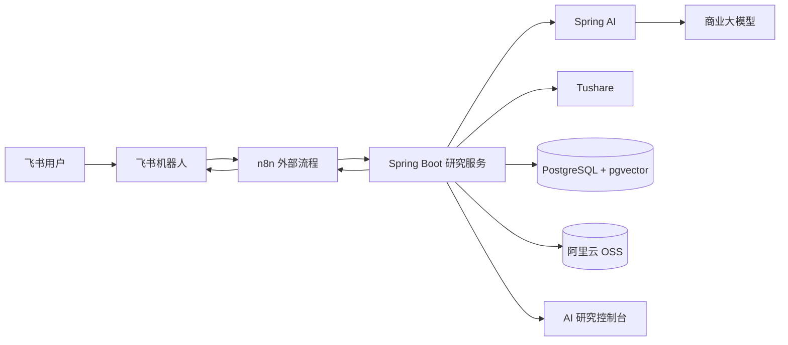
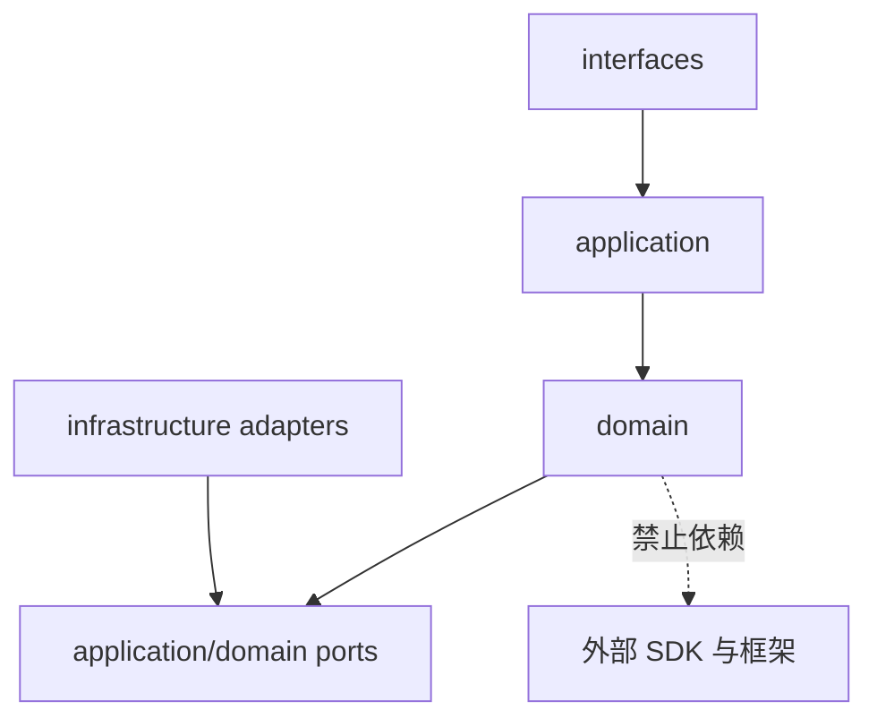

# 系统架构总览

- Status: Accepted
- Owner: Project
- Last reviewed: 2026-09-23
- Scope: 定义系统上下文、组件职责、模块边界和依赖方向；不定义领域对象细节、工作流节点契约或部署参数。
- Related ADRs: ADR-0001, ADR-0002, ADR-0003, ADR-0004

## 1. 架构目标

系统使用“受控工作流 + Agent 节点”的组合：业务状态、数据口径、确定性计算、质量门禁和恢复规则由程序控制；大模型在明确输入、工具、Schema 和预算内完成理解、规划、检索判断和综合表达。

架构首先服务单用户产品和学习目标，同时保留企业级系统需要的可审计性、可评测性、可恢复性和供应商可替换性。第一版采用模块化单体，避免在业务边界尚未验证时引入分布式复杂度。

## 2. 系统上下文



系统边界内的事实来源是 Spring Boot 研究服务及其数据库。飞书是交互渠道，n8n 是外部触发和通知编排器，模型不是业务状态或财经事实的事实来源。

## 3. 受控工作流与 Agent 节点

一个研究任务由程序定义阶段、前置条件、输入输出 Schema、超时、重试、质量门禁和发布条件。只有需要语义理解或综合判断的步骤使用 Agent 节点，例如：

- 将用户语言转换成结构化研究意图；
- 在候选工具和受限参数中制定 `AnalysisPlan`；
- 对检索证据做相关性判断；
- 综合结构化事实、计算结果和证据形成章节；
- 解释观点变化和失败原因。

Agent 不得自行跳过质量门禁、改变分析截止时间、写入未经验证的财经事实或直接发布报告。完整执行规则见 [Agent 工作流](agent-workflow.md)。

## 4. 飞书、n8n、Spring Boot 和 Spring AI 职责

| 组件 | 负责 | 不负责 |
| --- | --- | --- |
| 飞书机器人 | 接收对话、显示卡片和进度、提供报告与控制入口 | 业务规则、研究状态、财务计算 |
| n8n | Webhook、定时触发、调用 API、外部通知、简单重试和人工补偿入口 | 核心状态、复杂推理、报告事实 |
| Spring Boot | 领域规则、任务状态、数据标准化、确定性计算、证据、报告、版本、审计与 API | 渠道 UI、供应商专有推理 |
| Spring AI | 模型抽象、Prompt、结构化输出、Tool Calling、Embedding 和 Agent 支持 | 财经领域规则、权威数据和最终状态 |
| Vue 控制台 | 展示运行、产物、血缘、质量、成本和用户操作 | 重新实现后端规则 |
| PostgreSQL/pgvector | 事务状态、版本、事件、文本和向量索引 | 原始 PDF 二进制长期存储 |
| OSS | 原始 PDF 与正式报告资产 | 领域查询和任务状态 |

Spring Boot 是业务核心和权威状态持有者。n8n 只持有流程运行所需的短暂上下文，不能成为任务成功与否的唯一记录。

## 5. 数据与大模型职责边界

| 信息类型 | 权威处理方式 | 示例 |
| --- | --- | --- |
| 精确结构化数据 | Tushare 适配器与数据库 | 营收、净利润、ROE、PE、价格 |
| 确定性派生结果 | Java 领域服务 | 增长率、估值分位、同行排名 |
| 文本证据 | 文档解析、RAG 和引用校验 | 财报解释、风险因素、公告内容 |
| 综合判断与表达 | 受控大模型节点 | 经营质量总结、风险归纳、章节叙述 |

核心数字不得来自向量检索、模型记忆或模型心算。模型输出必须通过结构化 Schema，关键字段再由程序校验。每份正式报告绑定数据报告期、披露时间、获取时间、原始版本、文档页码、计算快照、Prompt、模型和报告版本。

## 6. 模块化单体边界

Spring Boot 应用按业务能力组织：

```text
company        公司、证券和行业身份
marketdata     财务、行情、估值和数据版本
disclosure     财报、公告和新闻原文
evidence       解析、分块、检索、引用和证据包
research       研究任务、基线、发现和最新观点
report         日周月报告、章节、PDF 和发布版本
conversation   意图、会话和上下文
watchlist      关注列表、事件和提醒
execution      ResearchRun、节点、事件、质量和用量
shared         时间、标识、审计等最小共享能力
```

模块内部采用 `domain`、`application`、`infrastructure` 和 `interfaces` 分层。领域层不依赖 Tushare、飞书、n8n、Spring AI、模型 SDK 或云厂商。跨模块调用使用显式应用服务、领域事件或端口，不能直接访问另一模块的内部仓储和实体。



## 7. 同步与异步交互

### 同步

- 普通知识问答和轻量意图识别；
- 缓存命中的快速数据查询；
- 查看报告、证据、任务和控制台状态；
- 创建任务、提交反馈和请求任务控制。

同步接口只返回已提交的权威状态。长任务返回 `202 Accepted` 语义和 `researchRunId`，不保持飞书请求连接等待完整研究。

### 异步

- 首次研究、完整报告和章节重生成；
- 数据同步、PDF 解析、Embedding 和检索索引；
- 日报、周报、月报和事件检查；
- 质量验证、PDF 渲染、通知和失败恢复。

第一版以 PostgreSQL 事务和 Outbox 保存不可变事件，通过后台 worker 和 SSE 推送状态。n8n 负责触发和外部通知，但消费失败后仍可从 Spring Boot 状态恢复。第一版不引入 Kafka。

## 8. 外部依赖

所有外部系统通过端口隔离：

- `MarketDataProvider`、`DisclosureProvider`、`NewsProvider` 对接 Tushare；
- `ChatModelPort`、`EmbeddingModelPort` 通过 Spring AI 对接阿里云百炼；
- `MessagingChannel` 对接飞书；
- `ObjectStoragePort` 对接阿里云 OSS；
- `WorkflowTriggerPort` 提供给 n8n；
- PostgreSQL 与 pgvector 由仓储适配器访问。

供应商、账户、权限和价格事实在 [外部服务参考](../reference/external-services.md) 维护，架构文档只定义依赖能力。

## 9. 演进原则

- 第一版使用一台 ECS、Docker Compose、模块化单体、PostgreSQL/pgvector 和 OSS。
- 不预先引入 Kubernetes、Kafka、Milvus、Redis 或微服务。
- 只有容量、故障隔离、独立扩缩、团队所有权或合规证据明确出现时才拆分服务。
- 每次拆分先通过 ADR 记录边界、数据所有权、迁移和回滚方案。
- 模型、数据源和云服务可替换，但领域模型、历史版本和证据链保持稳定。
- 渠道增加时复用应用服务，不把飞书特有结构带入领域层。
- 所有演进继续满足历史时点一致性、引用可追溯和确定性计算原则。
