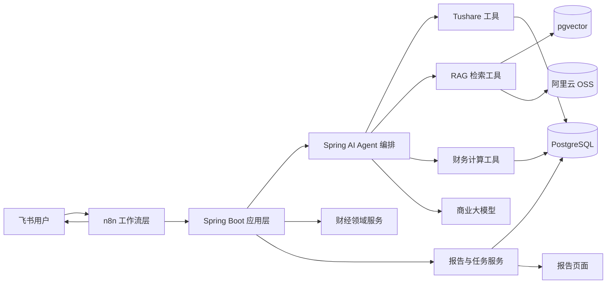
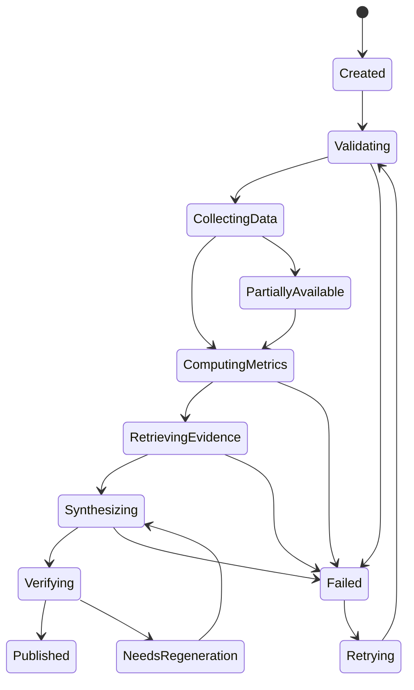
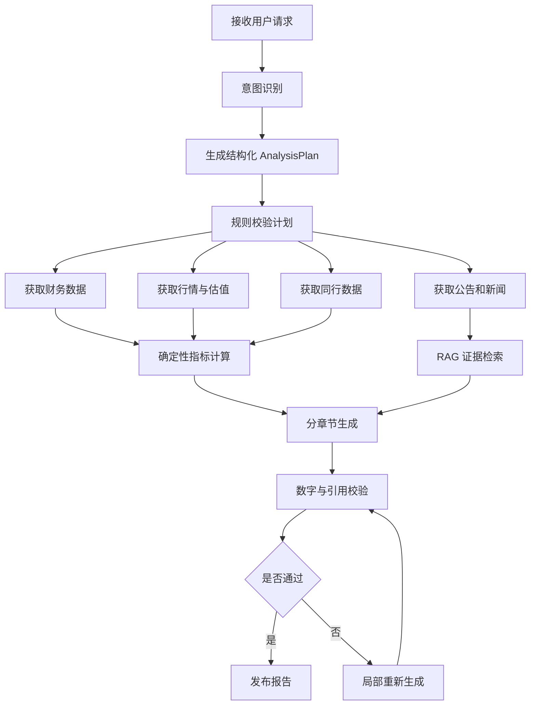
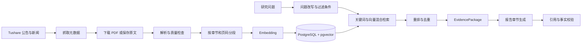
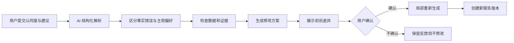
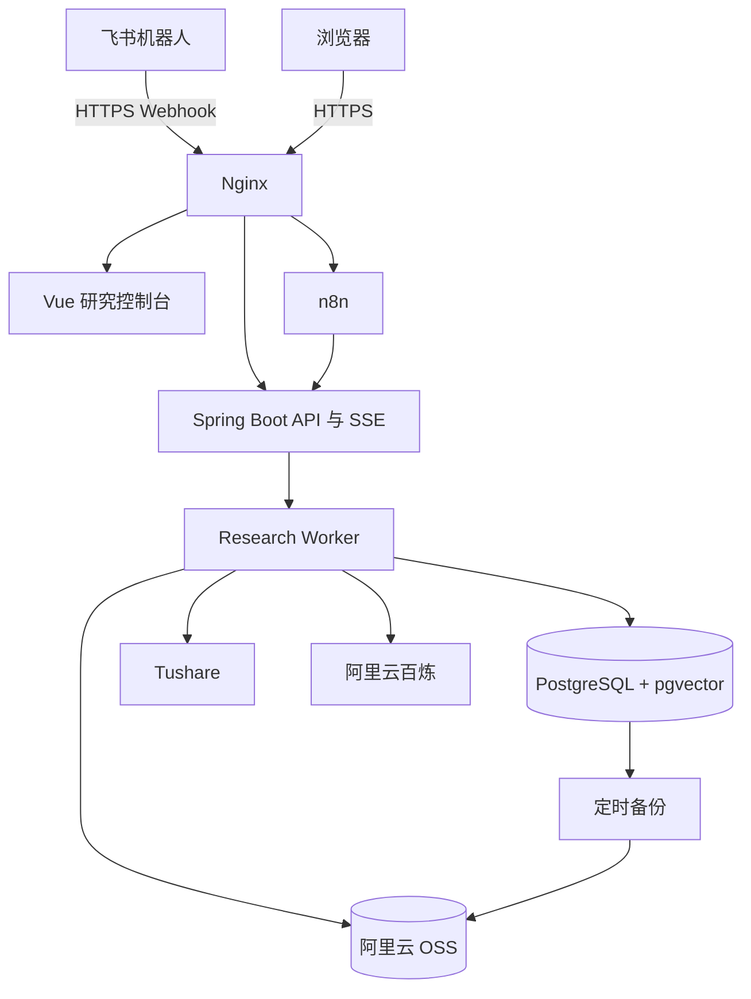

# A 股中长期研究 Agent 开发设计文档

> 状态：完整设计稿，等待最终评审；尚未进入实施计划阶段。
>
> 最后更新：2026-09-22

## 1. 项目目标

本项目面向个人使用，构建一个以 A 股为核心、服务月级别中长期研究的财经 Agent。用户通过飞书与系统交互，系统能够综合公司基本面、财报、估值、同行对比、公告和市场新闻，形成带时间口径、数据来源和风险提示的研究报告。

项目同时承担学习目标：通过一套完整、可运行的产品，系统掌握企业级 AI 应用中的模型调用、Tool Calling、RAG、工作流编排、领域建模、质量评测、可观测性、成本管理和迭代调优。

系统提供研究辅助，不接入用户持仓，不连接券商，不执行自动交易，也不输出确定性的仓位或买卖指令。

## 2. 已确认的产品范围

### 2.1 核心能力

- 通过飞书机器人发起公司分析和追问。
- 通过飞书进行普通财经问答、快速数据查询、上下文追问和受控操作。
- 生成包含基本面、财务趋势、估值、同行对比、风险与近期事件的完整报告。
- 管理自选关注列表并生成周期性周报。
- 针对财报发布、业绩预告、重大公告和明显风险事件发出提醒。
- 保存历史任务、报告版本、数据快照和证据引用。
- 支持失败重试、部分数据降级和可观测性分析。

### 2.2 后续完整工程能力

以下能力属于完整项目范围，但按里程碑逐步交付：

- Prompt、模型、工具和数据版本管理。
- 固定评测集、模型对比与回归测试。
- Token 成本、延迟、工具成功率和失败原因统计。
- 灰度发布、回滚、备份、安全与审计。
- 用户反馈驱动的 Prompt、检索和模型调优闭环。

## 3. 总体技术方案

系统采用 **Spring Boot + Spring AI 核心应用，n8n 外部流程编排** 的组合架构。



### 3.1 飞书机器人

- 接收自然语言指令和追问。
- 展示任务进度、摘要、失败信息和完整报告链接。
- 只承担渠道接入，不实现业务规则。

### 3.2 n8n

- 接收飞书 Webhook。
- 触发按需分析、定时周报和事件检查。
- 调用 Spring Boot API。
- 处理外部通知、简单重试和人工补偿入口。
- 不保存核心业务状态，不承担复杂 Agent 推理。

### 3.3 Spring Boot

Spring Boot 是系统的业务核心，负责：

- 用户意图与研究任务管理。
- 公司、财报、估值和同行等领域逻辑。
- Tushare 数据同步与标准化。
- 财务指标的确定性计算。
- RAG 文档入库与检索。
- 报告生成、版本、证据和审计管理。
- 异常恢复和对外 API。

### 3.4 Spring AI

Spring AI 作为 Spring Boot 内部的 AI 基础设施，负责：

- 商业模型调用与供应商抽象。
- Prompt 模板和结构化输出。
- Tool Calling。
- Embedding 与向量检索集成。
- 对话上下文和 Agent 编排支持。

Spring AI 不承载财经领域规则；可确定的计算与约束由普通 Java 代码实现。

## 4. 外部平台与部署选择

### 4.1 数据源

第一版只使用 Tushare，避免多数据源带来的口径和维护复杂度：

- 5000 积分基础数据：约 500 元/年。
- 公告接口：约 1000 元/年。
- 新闻接口：约 1000 元/年。
- 合计约 2500 元/年，折合约 208 元/月。

代码仍通过 `MarketDataProvider`、`DisclosureProvider`、`NewsProvider` 等端口隔离外部平台，但第一版只有 Tushare 实现。

### 4.2 模型

- 使用阿里云百炼商业模型 API。
- 普通意图识别、工具编排和结构化任务优先使用 Qwen3.7-Plus。
- 高价值综合报告可使用 Qwen3.8-Max。
- 通过 Spring AI 保留未来接入第二模型供应商的能力。

### 4.3 第一版基础设施

- 一台阿里云 ECS。
- Docker Compose。
- n8n。
- Spring Boot + Spring AI。
- PostgreSQL + pgvector。
- 阿里云 OSS。
- 飞书机器人。
- 阿里云百炼 API。
- Tushare。

第一版不引入 Kubernetes、Milvus、Kafka、Redis 或微服务拆分。只有明确出现容量、可用性或隔离需求时再演进。

## 5. 数据与 AI 职责边界

| 信息类型 | 处理方式 | 示例 |
| --- | --- | --- |
| 精确结构化数据 | Tushare API、数据库查询 | 营收、净利润、ROE、PE、股价 |
| 确定性派生结果 | Java 领域服务 | 增长率、估值分位、同行排名 |
| 文本证据 | RAG | 财报解释、风险因素、公告内容 |
| 综合判断与表达 | 大模型 | 经营质量总结、风险归纳、报告叙述 |

核心财务数字不得依赖向量检索或模型心算。模型负责理解、规划与综合表达，程序负责精确数据、计算和规则约束。

每份报告保存证据包，包括数据报告期、披露时间、系统获取时间、原始数据版本、文档与页码引用、Prompt 版本、模型版本、计算快照和最终报告版本。

## 6. 领域模型

### 6.1 市场与公司数据域

- `Company`：上市公司主体。
- `Security`：可交易证券，例如 `600519.SH`。
- `FinancialSnapshot`：指定报告期和披露版本的财务快照。
- `MarketSnapshot`：指定交易日的价格与估值快照。
- `IndustryClassification`：行业分类。
- `PeerGroup`：用于比较的同行公司集合。

`Company` 与 `Security` 分离，以支持未来一家公司多地上市等情形。

### 6.2 文档与证据域

- `SourceDocument`：财报、公告或新闻原文。
- `DocumentVersion`：文档版本。
- `EvidenceChunk`：带页码和元数据的检索片段。
- `Citation`：报告结论到原始证据的引用。

原始 PDF 保存于 OSS，文档元数据、解析文本和向量保存在 PostgreSQL 与 pgvector。

### 6.3 分析研究域

- `MetricResult`：确定性财务指标计算结果。
- `ValuationAssessment`：估值及历史位置判断。
- `PeerComparison`：同行对比结果。
- `RiskFinding`：带证据的风险发现。
- `ResearchFinding`：可追溯的中间研究结论。

原始数据、程序计算结果和模型解释必须分层保存，不能混入不可审计的单一 JSON。

### 6.4 任务与报告域

- `ResearchTask`：用户发起的研究目标。
- `AnalysisRun`：任务的一次具体执行。
- `ReportSection`：报告章节。
- `ResearchReport`：可版本化的最终报告。
- `EvidenceBundle`：本次执行使用的数据与引用快照。

一个 `ResearchTask` 可以产生多个 `AnalysisRun`，重试和重新生成不得覆盖历史结果。

### 6.5 观察与提醒域

- `Watchlist` 与 `WatchlistItem`。
- `AlertRule`。
- `MarketEvent`。
- `AlertNotification`。
- `WeeklyDigest`。

## 7. 领域建模原则

1. **时间是一等公民**：区分报告期、正式披露时间、数据可用时间和系统获取时间。
2. **原始数据尽量不可变**：修订产生新版本，不覆盖支撑旧报告的数据。
3. **结论必须有依据**：重要结论指向计算结果、结构化记录或文档引用。
4. **避免直接建模为买卖建议**：使用估值状态、经营质量、风险等级和证据强度表达研究判断。
5. **外部平台通过端口隔离**：核心领域不依赖 Tushare、飞书或特定模型 SDK。

## 8. 分析任务状态流



各阶段记录开始时间、结束时间、输入版本、输出摘要和失败原因。非核心数据缺失时可降级生成并明确提示；主体识别错误、核心财报缺失或关键数字无法验证时必须失败，不允许模型补全。

## 9. 公司研究报告框架

报告不是由单个大 Prompt 自由生成，而是由固定研究问题树驱动。Agent 针对每个问题收集结构化数据、计算结果和文档证据，最后再进行综合。

### 9.1 分析口径

- 公司与股票代码。
- 数据截止日期和最新财报期。
- 报告生成时间。
- 数据完整度与降级情况。

### 9.2 结论摘要

- 当前经营状态与估值状态。
- 最重要的积极因素和风险。
- 当前值得关注还是等待。
- 结论置信度和已知限制。

### 9.3 公司与商业模式

- 公司依靠什么业务盈利。
- 收入和利润的主要来源。
- 行业阶段、竞争优势和周期属性。

### 9.4 财务质量

- 营收、利润、ROE、毛利率和净利率的三至五年趋势。
- 经营现金流与净利润的匹配程度。
- 负债、商誉、应收账款和存货风险。
- 最新季度是否出现趋势变化。

### 9.5 增长质量

- 增长来自销量、价格、并购还是会计因素。
- 增长是否稳定、可持续。
- 管理层对未来的解释。
- 是否存在一次性收益。

### 9.6 估值分析

- 当前 PE、PB、股息率等指标。
- 自身历史估值位置。
- 与同行公司的估值比较。
- 盈利增长是否足以支撑当前估值。
- 不同假设下的合理估值区间。

### 9.7 同行对比

- 盈利能力。
- 成长性。
- 财务稳健性。
- 估值。
- 竞争地位。

### 9.8 近期事件

- 财报、业绩预告和重大公告。
- 管理层变化、监管、诉讼和减持。
- 行业政策与重要新闻。
- 可能影响未来数月的催化因素。

### 9.9 风险与证伪条件

- 当前判断依赖的核心假设。
- 会使判断失效的数据变化。
- 下一次财报的重点观察项。
- 尚无法量化的风险。

### 9.10 结论与观察计划

- 分别评价经营质量、成长、估值和风险。
- 表达当前估值吸引力与继续跟踪的理由。
- 明确下次重新评估的时间或触发条件。
- 不输出仓位比例和确定性买卖指令。

### 9.11 证据附录

- 指标计算口径。
- Tushare 数据及时间。
- 财报、公告与新闻引用。
- 缺失数据与降级说明。

### 9.12 分析结果表达

第一版不生成缺乏解释性的单一投资总分。系统分别呈现经营质量、成长质量、财务稳健性、估值吸引力、风险水平和证据完整度，并给出每个维度的等级与依据。

### 9.13 行业模板策略

- 第一批完整支持非金融类 A 股。
- 后续分别增加银行、保险和券商分析模板。
- 系统根据公司行业自动选择分析框架。
- 行业模板只改变指标、规则和问题树，不改变报告与任务的核心模型。

## 10. 报告生成职责

| 工作 | 执行者 |
| --- | --- |
| 公司代码识别、任务规划 | 大模型与规则校验 |
| 财务、行情、估值数据获取 | Tushare Tool |
| 增长率、分位数、同行排名 | Java 计算服务 |
| 财报解释和风险段落检索 | RAG |
| 同行选择 | 行业规则生成，模型辅助检查 |
| 综合判断和报告表达 | 大模型 |
| 数字、引用和完整性校验 | Java 校验器与模型检查 |
| 最终发布 | Spring Boot、n8n 与飞书 |

## 11. Agent 执行策略

### 11.1 方案选择

系统采用 **受控工作流 + Agent 节点**，不采用完全自由的循环式 Agent，也不在第一版引入角色扮演式多 Agent。

- 主任务阶段、最大调用次数、失败处理和发布条件由程序控制。
- 模型只在意图识别、结构化计划、语义检索、综合分析和表达等环节参与。
- 多 Agent 作为后续对照实验，只有评测证明其质量收益能够覆盖额外成本和复杂度时才引入。



### 11.2 结构化分析计划

模型首先输出受 Schema 约束的 `AnalysisPlan`，典型内容包括：

- 股票代码。
- 分析类型。
- 数据截止日期。
- 财务历史范围。
- 估值历史窗口。
- 是否包含同行、新闻与公告。
- 应使用的行业报告模板。

执行前由程序检查证券有效性、日期、未来数据、行业模板、查询规模和 Tushare 权限。模型不得绕过计划校验直接调用底层数据接口。

### 11.3 工具分层

#### 身份与基础信息

- `resolveSecurity`
- `getCompanyProfile`
- `selectPeerGroup`

#### 数据获取

- `getFinancialStatements`
- `getFinancialIndicators`
- `getMarketHistory`
- `getValuationHistory`
- `getDisclosures`
- `getCompanyNews`

#### 确定性分析

- `calculateFinancialTrends`
- `calculateCashFlowQuality`
- `calculateValuationPercentile`
- `compareWithPeers`
- `detectFinancialAnomalies`
- `buildScenarioValuation`

#### RAG 检索

- `searchReportEvidence`
- `searchRiskEvidence`
- `searchManagementExplanation`
- `searchEventEvidence`

#### 报告与质量

- `generateReportSection`
- `validateNumbers`
- `validateCitations`
- `validateReportCompleteness`
- `publishReport`

### 11.4 任务类型

| 任务 | 响应模式 | 目标场景 |
| --- | --- | --- |
| 快速问答 | 同步，目标 10～30 秒 | 单个指标或简单事实问题 |
| 完整研究 | 异步，目标 2～5 分钟 | 完整公司分析报告 |
| 批量跟踪 | 定时后台任务 | 自选股周报和事件提醒 |

完整研究开始后，飞书先返回任务已接受，完成后再发送摘要和报告链接，避免渠道 Webhook 长时间等待。

### 11.5 工程约束

- 每个工具使用强类型输入输出，不向模型开放 SQL。
- 工具结果包含来源、数据时间、完整度和错误状态。
- 相互独立的数据获取任务并行执行。
- 同一请求使用幂等键，重试不重复创建报告。
- 数据在有效缓存期内不重复调用 Tushare。
- 校验失败时优先局部重新生成受影响章节。
- 每次执行限制模型调用次数、Token 和工具调用数量。

## 12. RAG 设计

RAG 只负责从财报、公告和新闻中检索文本证据，不承担精确财务数据查询，也不作为对话记忆。



### 12.1 文档入库

1. 从 Tushare 获取公告、财报和新闻元数据。
2. 下载 PDF 或保存新闻原文。
3. 将原始文件保存到 OSS，并记录文件哈希和版本。
4. 优先解析 PDF 原生文本，扫描版 PDF 才进入 OCR。
5. 保留标题、章节、页码和表格附近的上下文。
6. 按语义章节切分，避免只按固定字符数机械截断。
7. 生成向量并写入 pgvector。
8. 对解析结果进行质量检查，失败文档进入人工处理队列。

每个 `EvidenceChunk` 携带股票代码、公司主体、文档类型、报告期、正式发布日期、系统获取时间、文档版本、章节标题、PDF 页码、原始文本和向量模型版本。

### 12.2 财报复杂表格

- 营收、利润、现金流和资产负债等核心数字使用 Tushare 结构化数据。
- PDF 表格主要用于寻找解释、附注和异常原因。
- PDF 与 Tushare 数字不一致时记录冲突，不允许模型自行选择。
- 第一版不追求通用解析所有复杂表格。
- 后续只针对经过需求验证的表格增加专项解析器。

### 12.3 检索策略

检索按以下顺序执行：

1. 解析公司、日期、报告期和问题类型。
2. 按股票、文档类型、时间和报告期进行元数据硬过滤。
3. 同时执行关键词检索和向量检索。
4. 合并、重排和去重结果。
5. 检查证据对问题的覆盖程度。
6. 返回结构化 `EvidencePackage`。

第一版使用 PostgreSQL 全文检索与 pgvector，不部署 Elasticsearch 或 Milvus。只有评测证明检索质量不足时，才增加专用搜索组件或重排模型。

### 12.4 历史时点约束

给定分析截止日期 `asOfDate`，只允许检索满足以下条件的材料：

```text
publishedAt <= asOfDate
availableAt <= asOfDate
```

文档更新生成新版本，不覆盖旧版本，以保证历史报告可以复现。

### 12.5 引用机制

RAG 返回的证据对象包含文档 ID、文档标题、发布日期、页码、章节、原文片段和相关性。关键研究结论通过 `Citation` 与证据对象关联，使用户可以从结论回溯至具体文档和页码。

### 12.6 防幻觉规则

- 核心数字只能引用结构化数据或确定性计算结果。
- 文本结论必须绑定证据编号。
- 证据不足时明确说明材料不足。
- 新闻观点不得被写成公司事实。
- 冲突信息同时保留并标注来源和时间。
- 校验器检查报告数字是否存在于输入数据中。
- 校验器检查高重要度结论是否具有引用。
- 外部文档全部按不可信数据处理，文档中的指令不得影响系统行为。
- 引用校验失败时只重新生成对应章节；连续失败后停止并进入检查状态。

### 12.7 RAG 与对话记忆

- RAG 检索财报、公告和新闻知识证据。
- 对话记忆保存当前股票、当前报告和追问上下文等必要结构化状态。
- 系统不无限携带完整聊天历史，长期事实与研究证据必须进入相应领域存储。

## 13. 持续研究与报告体系

系统采用日、周、月三级报告，并提供独立的“最新研究观点”。这些内容共享同一条研究时间线，不重复维护相互独立的数据副本。

### 13.1 日报：观察变化

每个交易日收盘后，为关注股票生成 `DailyResearchSnapshot`：

- 当日价格和估值变化。
- 新公告、财报和新闻。
- 新增风险或催化因素。
- 与上一交易日或研究基线相比的变化。
- 是否可能影响原有判断。
- 是否需要提前重建完整研究基线。

当天没有实质变化时只保存结构化快照，不生成冗长文本，也不调用大模型生成重复内容。飞书可将全部关注股票合并为简短日报。

### 13.2 周报：观察趋势

周报聚合一周内的每日变化，重点回答：

- 哪些股票发生了重要变化。
- 哪些公司的估值进入新区域。
- 哪些风险持续增强或减弱。
- 哪些事件形成趋势，哪些只是噪声。
- 下周应重点观察的公司与指标。
- 哪些股票需要重新进行完整分析。

周报是关注列表级别的趋势总结，不是七份日报的简单拼接。

### 13.3 月报：更新研究逻辑

月报作为完整研究基线，覆盖商业模式、财务趋势、最新季度、现金流和资产负债质量、估值、同行、累计事件影响、风险、证伪条件与下月观察项。

发生新财报、业绩预告或重大风险事件时，可以不等待月末，提前重建完整研究基线。

### 13.4 重大事件提醒

重大事件提醒独立于三级报告：

| 等级 | 示例 | 通知方式 |
| --- | --- | --- |
| 高 | 立案调查、退市风险、重大违约、业绩大幅修正、重大资产风险 | 验证后立即提醒 |
| 中 | 财报、业绩预告、分红、回购、减持、重大合同 | 当日汇总提醒 |
| 低 | 常规公告、一般行业新闻、重复报道 | 进入日报或周报 |

系统先通过文档哈希和事件指纹去重，再使用公告类型与关键词规则初筛，最后由模型进行结构化事件分类。高等级事件必须具有原始公告或可靠新闻证据，不能仅根据模型或标题触发。

### 13.5 默认频率

- 日报：每个交易日 22:30。
- 周报：每周日 20:00。
- 月报：每月结束后的第一个周日。
- 高等级事件：验证后立即提醒。
- 新财报或重大事件：提前重建完整研究基线。
- 非交易日无新增内容时不生成空报告。

具体时间由 n8n 配置，不进入核心业务代码。

## 14. 最新研究观点

系统提供 `CurrentInvestmentView`，用于回答“现在怎么看这只股票”。它属于非个性化研究辅助，不输出持仓比例和确定性买卖指令。

### 14.1 观点组成

```text
最近月报：完整研究逻辑
    +
最近周报：近期趋势
    +
最新日报：当日增量
    +
重大事件：即时影响
    +
查询时最新价格、估值和公告
    =
CurrentInvestmentView
```

系统展示经营质量、成长质量、财务稳健性、估值吸引力、风险水平、证据强度和结论新鲜度，并使用以下研究状态表达当前观点：

- 值得深入关注。
- 等待更好估值。
- 等待基本面验证。
- 风险上升。
- 暂时回避研究。
- 信息不足。

### 14.2 可解释变化

观点变化必须保留前后版本，并说明：

- 上次观点与当前观点。
- 导致变化的数据、公告或事件。
- 哪些原有假设失效。
- 下一次需要验证的指标或事件。

这部分历史记录同时作为后续模型、Prompt 和规则评测的数据集。

### 14.3 领域对象

- `ResearchBaseline`：最近一次完整研究基线。
- `DailyResearchSnapshot`：每日结构化状态。
- `ResearchChangeSet`：相对前一状态的变化。
- `DailyChangeBrief`：有实质变化时生成的增量摘要。
- `CurrentInvestmentView`：综合基线、增量和查询时数据的最新研究视图。
- `ResearchTimeline`：连接月报、周报、日报、事件和观点版本的统一时间线。

## 15. 首次分析与冷启动

投资观点的依据是底层数据、确定性计算和文档证据，而不是日、周、月报本身。报告是研究资产在不同时间尺度下的视图。

### 15.1 冷启动任务

股票首次被查询或加入关注列表时，系统创建 `BootstrapResearchTask`：

1. 解析证券、公司和行业身份。
2. 获取三至五年财务数据、行情和估值历史。
3. 选择同行并获取对比数据。
4. 获取最新财报、公告和新闻。
5. 下载并解析必要文档，完成 RAG 入库。
6. 执行确定性计算与证据检索。
7. 检查最低数据和证据门槛。
8. 生成 `InitialResearchBaseline`。
9. 生成首个 `CurrentInvestmentView`。

`InitialResearchBaseline` 与月级完整报告具有相同研究深度，但不需要等待月末。

### 15.2 两阶段输出

- `PROVISIONAL`：结构化数据已准备，但文档证据尚未完全处理时，可提供明确标记的初步事实和估值观察，不给出强研究结论。
- `VERIFIED`：只有主体、核心财务、最新财报、估值历史、同行、近期重大公告、数字校验和引用校验均满足最低门槛后，才发布正式最新研究观点。

证据不足时状态为 `INSUFFICIENT_EVIDENCE`，系统只返回事实摘要。系统不得为了给出观点而让模型补全缺失信息。

### 15.3 生命周期

```text
UNINITIALIZED
    ↓
BOOTSTRAPPING
    ↓
PROVISIONAL
    ↓
VERIFIED
```

异常或过期分支包括：

```text
BOOTSTRAPPING → INSUFFICIENT_EVIDENCE
BOOTSTRAPPING → FAILED
VERIFIED → STALE → REFRESHING
```

最新财报或重大事件尚未处理完成时，原有观点必须标记为 `STALE`，不能继续包装为最新结论。

### 15.4 关注列表预热

股票加入关注列表后立即在后台执行冷启动任务，提前建立研究基线和最新研究观点。未被关注且从未分析的股票在首次查询时现场启动冷分析，飞书先返回任务进度，完成后主动通知。

## 16. AI 研究控制台

AI 研究控制台（Research Control Plane）是核心产品模块，用于展示某只股票的研究执行阶段、系统数据流、Agent 行为、质量门禁、成本和异常恢复。它不同于基础设施日志或 Grafana，是面向研究任务的产品级可观测界面。

### 16.1 两级页面

#### 系统总览

- 所有关注股票的当前研究状态。
- 日报、周报和月报任务队列。
- 正在运行、等待、失败、证据不足和过期的任务。
- 最近研究观点发生变化的股票。
- 数据新鲜度和异常情况。
- 当日模型成本、调用量和失败率。

#### 股票研究详情

- 当前执行阶段和完整 `AnalysisPlan`。
- 数据获取、计算、RAG、生成和校验的实时 DAG。
- 每个节点的输入、输出、耗时、状态和重试次数。
- AI 当前目标、执行原因、等待项和下一步。
- 数据来源、计算结果、证据和结论之间的血缘关系。
- 数字一致性、引用有效性和证据覆盖率等质量门禁。
- 模型、Prompt、Token、延迟和费用。
- 日报、周报、月报和最新研究观点版本。
- 暂停、取消和从指定节点局部重试的入口。

### 16.2 AI Native 原则

- **计划可见**：展示模型生成且经程序验证的研究计划。
- **过程可解释**：用自然语言说明当前目标和等待原因。
- **产物可检查**：每个执行节点输出可查看的结构化数据、证据或报告章节。
- **血缘可追踪**：结论可回溯至计算结果、Tushare 数据、公告和财报页码。
- **质量可观察**：明确展示尚未通过的质量门禁，不能用单一进度百分比掩盖问题。
- **成本可测量**：记录步骤级模型、Token、耗时和费用。
- **局部可恢复**：失败时从节点级别重试，避免重跑整个任务。
- **历史可比较**：解释研究观点在不同版本间为何发生变化。

### 16.3 执行与事件模型

- `ResearchRun`：一次完整研究执行。
- `ExecutionNode`：DAG 中的一个可运行步骤。
- `ExecutionEvent`：节点状态变化形成的不可变事件。
- `ResearchArtifact`：数据快照、证据包、计算结果和报告章节等节点产物。
- `LineageEdge`：产物、证据和结论之间的血缘关系。
- `QualityGateResult`：质量规则及其通过状态。
- `HumanIntervention`：暂停、取消、批准和节点重试记录。
- `ModelUsageRecord`：模型、Prompt、Token、延迟和费用记录。

### 16.4 技术实现

```text
Spring Boot 记录 ResearchRun / ExecutionNode / ExecutionEvent
        ↓
PostgreSQL Outbox 保存不可变事件
        ↓
SSE 推送服务端状态变化
        ↓
Vue 3 + TypeScript 研究控制台
```

第一版不引入 Kafka。PostgreSQL 事务、Outbox 事件表和 SSE 足以支撑单用户研究控制台。n8n 只触发任务，不作为执行状态的事实来源。

## 17. Prompt、模型路由与上下文管理

### 17.1 Prompt 分层

系统不维护不断膨胀的单一 Prompt。每次模型请求由以下层次组合：

1. **平台级约束**：禁止伪造数据和引用、防止外部文档指令注入、不输出个性化仓位建议、证据不足时明确说明。
2. **财经研究规则**：精确数字来自结构化数据；区分报告期、披露日和分析截止日；区分事实、推断与市场观点；按行业选择研究规则。
3. **任务模板**：意图识别、分析计划、事件分类、证据检索、章节生成、最新研究观点和质量检查分别使用独立模板。
4. **工具与输出 Schema**：工具白名单、强类型参数、必填字段、枚举和引用格式由 Schema 约束。
5. **ResearchContext**：只提供当前任务必需的数据、计算结果和证据。

Java 在模型生成后再次执行 Schema 和业务规则校验。

### 17.2 Prompt 版本管理

Prompt 模板以 Markdown 或 YAML 保存在代码仓库中，每个版本记录：

- `promptKey` 与 `promptVersion`。
- 内容哈希。
- 适用任务。
- 允许调用的工具。
- 输出 Schema。
- 创建时间和变更说明。

数据库记录当前启用版本。每次调用保存 Prompt 版本、模型版本、上下文哈希、数据与证据版本、生成结果、Token、费用、延迟和校验结果，以支持对比、回归与回滚。

### 17.3 模型路由

| 任务 | 模型策略 |
| --- | --- |
| 股票名称识别、意图分类 | 规则优先，必要时使用 Qwen3.7-Plus |
| `AnalysisPlan` 生成 | Qwen3.7-Plus |
| 查询改写、事件分类 | Qwen3.7-Plus |
| 日报增量摘要 | 无变化时不用模型；有变化时使用 Qwen3.7-Plus |
| 周报趋势综合 | Qwen3.7-Plus |
| 首次完整分析与月报 | 子任务使用 Plus，最终综合使用 Qwen3.8-Max |
| 最新研究观点刷新 | 默认 Plus；投资逻辑重大变化时使用 Max |
| 报告校验 | Java 规则优先，语义检查使用 Plus |
| Embedding | 独立 Embedding 模型 |

`ModelRouter` 根据任务类型、价值、复杂度、时效和预算选择模型，Agent 不能自行任意指定。高价值报告若高级模型不可用，应重试或明确标记降级，不得静默替换后宣称结果完全等价。

### 17.4 上下文管理

每个模型节点只接收完成当前任务必需的上下文。完整报告按章节分别生成，随后执行跨章节一致性检查和摘要综合。

`ConversationState` 只保存当前股票、当前执行、报告版本、最近问题、相关上一结论和对话摘要。追问必须绑定具体报告、结论和证据，而不是依靠无限增长的聊天记录。

财报、公告、新闻和网页内容全部作为不可信数据处理。模型只能从 `EvidencePackage` 获取研究证据，必须忽略外部材料中试图改变系统行为的指令。

### 17.5 分章节生成

```text
财务质量 ─┐
增长质量 ─┤
估值分析 ─┼→ 跨章节一致性检查 → 最终摘要
同行对比 ─┤
风险分析 ─┘
```

分章节生成允许并行、精确控制上下文、局部重试和步骤级质量与成本统计。最终摘要只能使用已通过校验的章节，不得引入新的无来源数字。

### 17.6 控制台可观测性

每个模型节点展示模型选择原因、Prompt 版本、输入数据与证据摘要、结构化输出、校验结果、Token、费用和延迟。默认隐藏完整敏感 Prompt，调试模式下可查看执行快照。

## 18. 质量评测与反馈闭环

### 18.1 分层评测

系统从五个层级评测质量：

| 层级 | 评测对象 | 核心问题 |
| --- | --- | --- |
| 数据层 | Tushare、时间口径、计算结果 | 数字是否正确 |
| 检索层 | RAG 与证据 | 是否找到正确材料 |
| 生成层 | 报告内容 | 是否忠于数据、完整且一致 |
| Agent 层 | 计划与工具调用 | 是否走了正确流程 |
| 产品层 | 速度、成本、用户体验 | 是否真正好用 |

### 18.2 固定评测集

初期建立约 20～30 个版本化 A 股研究案例，覆盖不同行业和典型情形，包括高质量高估值、低估值基本面恶化、周期变化、财报修订、重大风险、数据缺失、名称歧义、来源冲突和历史时点分析。

每个 `EvalCase` 保存固定截止日期、冻结输入、必须出现的事实、必须引用的证据、禁止出现的错误结论、允许存在差异的分析部分和人工评分标准。

### 18.3 硬性质量门禁

以下任一关键检查失败时报告不得发布：

- 股票主体识别错误。
- 使用了分析截止日期之后的数据。
- 核心数字无法在输入数据或计算结果中找到。
- 单位、币种或报告期错误。
- 引用不存在或页码无效。
- 高重要度结论缺少证据。
- 输出不符合 Schema。
- 违反工具调用和执行限制。

### 18.4 RAG、报告和 Agent 指标

RAG 评估必要证据召回率、有效证据比例、元数据过滤准确率、引用支持度、关键风险遗漏、重复召回和解析失败率。

报告分别评估事实正确性、证据覆盖、财务与估值逻辑、风险覆盖、事实与推断区分、跨章节一致性、清晰度和结论稳定性。

Agent 评估计划正确性、无效或重复工具调用、行业模板选择、证据不足时停止、局部重试、调用上限和相同输入下的一致性。

确定性检查优先。模型可以辅助语义评分，但必须以人工样本校准，不能只依赖 LLM Judge。

### 18.5 产品与成本指标

- 首次分析和最新观点查询耗时。
- 日、周、月报按时完成率。
- Tushare、PDF 解析、模型和工具成功率。
- 单只股票日报、单份月报和单次查询成本。
- 缓存命中率和局部重试成功率。

第一版先积累真实数据，再制定正式 SLA。

### 18.6 每份报告的用户反馈

每份日报、周报、月报和最新研究观点均支持：

- 五级整体认同度：完全不认同、不太认同、部分认同、比较认同、完全认同。
- 对经营、成长、估值、风险等维度分别反馈。
- 快速标记数字错误、信息遗漏、引用不足、风险判断偏差、估值逻辑、同行选择、结论强度和表达问题。
- 输入自然语言修改建议。
- 对整份报告、章节、具体结论、数字或引用进行定点反馈。

认同度反映用户是否认可分析逻辑，不直接等同于报告客观正确性。

### 18.7 反馈解释与报告修订

模型将自然语言建议解析为 `FeedbackInterpretation`，识别反馈目标、问题类型、用户意见、建议修改和是否需要数据验证，并先向用户展示系统理解。



原报告不可覆盖，修改产生新版本并记录修改原因。事实纠正必须重新验证数据；分析方法调整先展示方案；个人研究偏好经明确确认后写入可见、可修改、可删除的 `ResearchPreferenceProfile`。

### 18.8 反馈领域对象与状态

- `ReportFeedback`
- `FeedbackTarget`
- `FeedbackInterpretation`
- `RevisionProposal`
- `ReportRevision`
- `ResearchPreferenceProfile`

反馈状态包括 `RECEIVED`、`INTERPRETED`、`VERIFYING`、`REVISION_PROPOSED`、`USER_APPROVED` 和 `APPLIED`，异常或终止状态包括 `REJECTED`、`INSUFFICIENT_EVIDENCE` 和 `CONVERTED_TO_EVAL_CASE`。

代表性问题转换为固定评测案例，避免后续 Prompt、模型或 RAG 调整重新引入同类问题。

### 18.9 调优与发布闭环

问题先归因为数据与计算、检索、Prompt、模型或工作流，再新增回归案例并离线评测。通过质量门禁后进行影子运行和人工对比，最后小范围启用并正式发布。单用户场景不做随机线上 A/B 测试，而使用冻结输入的新旧版本对比。

长期不以股价涨跌作为唯一质量标准，而追踪风险是否被提前识别、证伪条件是否有效、观点变化是否及时、是否遗漏当时已经公开的重要信息，以及估值判断是否与后续基本面匹配。

## 19. 运行保障、安全与成本控制

### 19.1 故障分类

| 故障类型 | 示例 | 默认处理 |
| --- | --- | --- |
| 数据源故障 | Tushare 超时、限流 | 自动重试，必要时使用已有快照并标记时间 |
| 数据质量故障 | 报告期、单位或数字冲突 | 停止相关章节，进入检查状态 |
| 文档处理故障 | PDF 下载、解析或 OCR 失败 | 分层重试，只限制依赖该证据的能力 |
| 模型故障 | 超时、限流、Schema 错误 | 有限重试，必要时明确降级 |
| 工作流故障 | 节点中断、服务重启 | 从最近成功节点恢复 |
| 发布故障 | 飞书通知失败 | 报告照常保存，单独重试通知 |
| 安全故障 | 签名错误、异常调用 | 拒绝请求并记录审计事件 |

故障必须具有明确错误码、可重试属性和归属层级，不能只保存通用的 Agent 执行失败。

### 19.2 重试与恢复

- 网络超时、限流和临时服务错误使用指数退避重试。
- 模型输出不符合 Schema 时携带校验错误局部重试一次。
- 确定性计算错误不能通过模型重试掩盖。
- PDF 原生解析失败后可尝试 OCR。
- 引用不足时重新检索一次，再失败则降低结论强度或阻止对应结论。
- 飞书发送失败由 Outbox 重试，不重新生成报告。
- 服务重启后从最后完成的 `ExecutionNode` 继续。

所有执行节点幂等，重复执行不得产生重复报告、通知或费用记录。

### 19.3 降级与发布规则

核心数据包括公司身份、最新有效财务报表、核心财务指标、当前价格与估值和分析截止日期。核心数据缺失时不得发布正式观点。

重要数据包括同行对比、最新财报文本、重大公告和历史估值。部分缺失时可以发布 `LIMITED` 报告，但必须降低证据等级并说明限制。

补充数据包括一般新闻、非核心行业观点和次要公告，缺失时不影响核心报告，只在附录说明。

发布状态分为 `VERIFIED`、`LIMITED`、`STALE`、`PROVISIONAL` 和 `BLOCKED`。系统可以降级，但不能静默降级。

### 19.4 PDF 永久研究资产

PDF 一旦进入系统即作为永久、不可变、可查看的研究证据保存。原文件保存在私有 OSS Bucket，报告引用稳定的应用地址：

```text
https://research.example.com/documents/{documentId}/view#page={page}
```

用户地址永久不变。Spring Boot 验证身份后从 OSS 读取文件或生成内部短期访问凭证，并由内置查看器打开到指定页码。OSS 不公开，内部签名过期不影响用户收藏和历史报告链接。

每个文档永久保存原始 PDF、哈希、来源、股票代码、文档类型、报告期、披露时间、获取时间、文档版本、解析文本、页码映射和处理状态。修订产生新版本，不覆盖旧文件；除非用户明确删除，文件不会因缓存过期、报告更新或移出关注列表而删除。

PDF 状态分离处理：

- 已保存但解析失败：原文仍可永久查看，RAG 暂不可用。
- 解析成功但部分表格置信度较低：原文和文本可用，相关证据标记低置信度。
- 尚未下载成功：重新下载，依赖该文档的文本结论暂不生成。

分别统计原始文件保存成功率、永久查看可用率、文本解析成功率、OCR 成功率、页码映射准确率和 RAG 入库完成率。PDF 解析质量不等同于系统稳定性。

### 19.5 安全

- 仅允许指定飞书用户或群组调用，并验证回调签名与时间戳。
- 网页控制台必须登录并使用 HTTPS。
- PostgreSQL、n8n 和内部 Spring Boot 接口不直接暴露公网。
- OSS Bucket 私有，数据库账号遵循最小权限。
- Tushare、模型和飞书密钥不得进入代码仓库和日志。
- 第一版使用受保护的环境配置或 Docker Secret，后续可接入阿里云 KMS。
- 外部文档下载限制允许域名、类型、大小、时间和重定向次数。
- 分析、重试、反馈、Prompt 切换和权限变化记录审计日志。

### 19.6 双层可观测性

产品可观测性由 AI 研究控制台承担。技术可观测性使用统一 `traceId`、JSON 结构化日志、Spring Boot Actuator、Micrometer 和 OpenTelemetry，覆盖飞书、n8n、Spring Boot、模型、Tushare、OSS 和数据库。

第一版业务指标保存在 PostgreSQL，基础设施使用阿里云监控。经过实际运行验证有需要时再增加 Prometheus、Grafana 或日志服务。

### 19.7 系统告警

系统运维通知与股票事件提醒分开。数据库、OSS、外部 API、任务停滞、费用和备份问题归入运行告警；PDF 解析失败率、引用覆盖和质量门禁问题归入数据质量告警。PDF 解析异常不等同于服务不可用。

### 19.8 成本控制

每次执行建立 `CostLedger`，记录股票、任务、报告类型、模型、Token、Embedding、工具调用、耗时、估算费用和缓存节省金额。

设置单次任务、每日和每月预算。达到 70% 时控制台提示，达到 90% 时发送告警，达到 100% 时暂停非必要生成任务。数据同步、重大公告抓取、确定性计算和高等级风险检测继续运行；无变化摘要、重复完整报告、影子评测和低优先级模型对比可以暂停。

### 19.9 审计

Prompt 与模型路由切换、人工重试或取消、用户反馈应用、报告版本修改、研究偏好变化、数据冲突处理和权限配置变化均记录不可变审计事件。系统能够复现报告的数据、文档、执行节点、模型、Prompt、重试和最终发布原因。

## 20. 阿里云部署与运维

### 20.1 部署拓扑



第一版使用 Docker Compose 部署 Nginx、Vue 前端、Spring Boot API、Research Worker、n8n、PostgreSQL + pgvector、备份任务和基础监控采集器。API 与 Worker 共用代码库，通过不同运行配置启动，避免耗时任务影响交互接口。

### 20.2 规格演进

- 开发与调试主要在本地完成。
- 云上试运行使用 2 核 8 GB、80～120 GB ESSD 和 3 Mbps 带宽。
- 适合约 10～15 只关注股票和较低并发。
- 运行两至四周后，根据 CPU、内存、OCR、日报批处理和完整报告耗时判断是否升级至 4 核 8 GB。
- 不购买 GPU，模型推理使用商业 API。

### 20.3 存储与备份

- PostgreSQL 使用独立数据盘，不开放公网端口。
- PDF、数据库备份和长期研究资产保存于私有 OSS。
- PostgreSQL 每日逻辑备份并加密上传 OSS。
- 每周创建数据盘快照。
- 保留最近 30 份日备份和 12 份月备份。
- 每月执行恢复演练。
- OSS 开启版本控制，文档使用内容哈希防止覆盖。
- n8n 使用 PostgreSQL，并定期导出工作流定义。
- 密钥不进入普通备份文件。

第一版恢复目标为 RPO 不超过 24 小时、RTO 为 4～8 小时。已保存到 OSS 的原始 PDF 不依赖 ECS 磁盘恢复。

### 20.4 地域、域名与 HTTPS

长期采用中国内地地域，例如杭州或上海，并完成域名实名认证、ICP 备案、HTTPS 和上线后的相关备案流程。开发期间在本地推进，备案流程并行进行，不阻塞开发。若必须立即公网试用，可临时选择中国香港地域，但长期预算和访问体验需重新评估。

### 20.5 月度预算

#### 2 核 8 GB 试运行

| 项目 | 月均估算 |
| --- | ---: |
| ECS | 255～300 元 |
| 带宽、云盘、快照 | 100～160 元 |
| OSS | 5～20 元 |
| 商业模型 API | 30～120 元 |
| Tushare | 约 208 元 |
| 域名等摊销 | 5～15 元 |
| **合计** | **约 600～820 元/月** |

#### 4 核 8 GB 稳定运行

| 项目 | 月均估算 |
| --- | ---: |
| ECS | 464～546 元 |
| 带宽、云盘、快照 | 120～180 元 |
| OSS | 5～25 元 |
| 商业模型 API | 50～150 元 |
| Tushare | 约 208 元 |
| 域名等摊销 | 5～15 元 |
| **合计** | **约 850～1120 元/月** |

预算不依赖新用户或限时优惠。第一版不购买 RDS；达到明确的恢复、并发或运维压力后再评估托管数据库。

### 20.6 价格参考

- [阿里云 ECS 价格](https://ecs-buy.aliyun.com/price)
- [阿里云 OSS 价格](https://cn.aliyun.com/price/detail/oss)
- [ECS 快照计费](https://help.aliyun.com/zh/ecs/snapshots-1)
- [百炼模型价格](https://help.aliyun.com/en/model-studio/model-pricing)
- [阿里云个人网站备案](https://help.aliyun.com/zh/icp-filing/basic-icp-service/getting-started/quick-start-for-icp-filing-for-personal-websites)
- [Tushare 积分与接口权限](https://tushare.pro/document/1?doc_id=290)

实际费用随地域、实例代际、购买时长、折扣和使用量变化，购买前需要通过官方价格页复核。

## 21. 飞书对话能力

飞书机器人同时承担财经对话助手、数据查询入口、研究报告助手和 Agent 任务控制入口。普通对话不会默认创建完整研究任务或生成 PDF。

### 21.1 对话意图

- `GENERAL_FINANCE_QA`：普通财经知识问答。
- `QUICK_DATA_QUERY`：行情、财务和公告等快速查询。
- `REPORT_FOLLOW_UP`：针对具体报告、章节、结论或引用追问。
- `COMPARATIVE_ANALYSIS`：公司之间的快速比较。
- `FULL_RESEARCH_REQUEST`：创建完整异步研究任务。
- `WATCHLIST_COMMAND`：新增、移除和查看关注股票。
- `REPORT_FEEDBACK`：提交认同度和修改建议。
- `TASK_CONTROL`：暂停、取消、重试或重新生成。
- `OUT_OF_SCOPE`：超出财经研究产品范围的问题。

### 21.2 回复形态

| 用户请求 | 返回方式 |
| --- | --- |
| 普通知识问题 | 飞书文本 |
| 简单数据查询 | 文本或紧凑卡片 |
| 报告追问 | 文本、引用和 PDF 页码链接 |
| 公司对比 | 对比卡片，必要时提供完整报告 |
| 完整分析 | 进度消息、摘要卡片、网页报告和 PDF |
| 日报、周报和月报 | 摘要卡片、网页报告和 PDF |

### 21.3 连续对话

`ConversationSession` 保存当前股票、比较对象、报告版本、报告章节、分析截止日期、最近任务、已确认研究偏好和压缩后的对话摘要。原始消息用于审计，但模型只接收当前任务需要的上下文。

代词、简称和“它”“刚才那份报告”等引用必须通过会话状态解析。存在歧义时要求用户确认，涉及关注列表、报告修订、任务取消等状态修改时先展示理解结果再执行。

### 21.4 对话事实约束

- 普通知识问题可以使用模型通用知识。
- 当前行情、估值和公司数据必须通过工具查询。
- 快速回答同样展示数据截止时间。
- 公司文本结论需要证据引用。
- 过期观点必须明确标记。
- 不允许模型根据记忆猜测实时数据。

### 21.5 响应目标

- 普通问答：数秒级。
- 快速数据查询：目标 5～15 秒。
- 报告追问：目标 10～30 秒。
- 公司比较：根据缓存情况目标 20～60 秒。
- 完整研究：异步执行，先返回任务受理和进度。

普通对话、上下文追问和受控操作纳入 M3，使第一个可用版本从一开始就是可对话 Agent，而不是只会提交任务和返回 PDF 的机器人。

## 22. 分阶段交付与验收

MVP 只是第一个可用节点，后续能力仍属于完整产品路线。首轮实施最低目标为完成 M4。

### 22.1 M0：技术链路验证

预计 3～5 个工作日。打通飞书、n8n、Spring Boot、Spring AI、Tushare、商业模型和 PostgreSQL 的最小闭环。

验收标准：

- 飞书发送分析请求可以创建任务。
- Spring Boot 可以获取公司和基础财务数据。
- 模型生成结构化摘要。
- PostgreSQL 保存任务、数据和模型执行记录。
- 请求具有贯穿全链路的 `traceId`。
- 密钥不进入代码仓库。

### 22.2 M1：财经数据与领域核心

预计 1～2 周。交付公司、证券、行业、同行、财务、行情、估值、历史时点、确定性计算、Tushare 适配器和数据版本。

验收标准：

- 完整同步一只非金融公司的三至五年数据。
- 指定历史日期时不使用未来数据。
- 核心指标由 Java 计算并具有单元测试。
- 同一任务重复执行不产生重复数据。
- 数据修订不覆盖旧版本。

### 22.3 M2：PDF 与 RAG 证据系统

预计 1～2 周。交付 PDF 永久存储与查看、原生解析、OCR 降级、混合检索、证据包、引用校验和历史时点过滤。

验收标准：

- 引用可以跳转到永久 PDF 及对应页码。
- 解析失败时原文仍可查看。
- RAG 不检索截止日期之后的文档。
- 核心数字不从向量检索中获取。
- 外部文档不能改变系统行为。

### 22.4 M3：完整公司研究与对话 Agent

预计 1～2 周。交付受控 `AnalysisPlan`、冷启动、完整报告、分章节生成、质量门禁、最新研究观点、普通对话、快速查询、报告追问和受控操作。

验收标准：

- 未分析股票可以可靠冷启动。
- 证据不足时不生成正式观点。
- 核心数字和重要引用通过校验。
- 单个章节可以独立重试。
- 用户可以询问“现在怎么看这只股票”。
- 连续对话可以正确继承股票、报告和比较对象。
- 普通问答不创建不必要的完整研究任务。

完成 M3 后形成第一个真正可用的产品版本。

### 22.5 M4：持续研究与飞书产品体验

预计 1～2 周。交付关注列表、日报、周报、月报、每日研究快照、增量分析、重大事件提醒、飞书卡片和缓存。

验收标准：

- 加入关注列表后自动完成研究预热。
- 每个交易日生成结构化快照。
- 无变化时不生成重复长文。
- 周报总结趋势而非拼接日报。
- 月报形成新的完整研究基线。
- 高等级事件去重和验证后通知。
- 最新观点组合月报、周报、日报和查询时数据。

M4 是首轮实施必须达到的最低交付范围。

### 22.6 M5：AI 研究控制台与反馈

预计 1～2 周。交付系统总览、股票运行详情、实时 DAG、SSE、数据血缘、质量门禁、成本视图、节点控制以及报告认同度和修订流程。

验收标准：

- 实时看到股票研究执行阶段。
- 可以解释 AI 当前目标和等待原因。
- 结论可以回溯到数据、计算或文档。
- 失败节点可以单独重试。
- 反馈可以绑定报告、章节或结论。
- 修订产生新报告版本，不覆盖原报告。

### 22.7 M6：评测、稳定性与生产部署

预计 1～2 周。交付固定评测集、Prompt 和模型对比、质量门禁、安全、限流、审计、成本告警、生产部署、HTTPS、备份和恢复演练。

验收标准：

- Prompt 或模型切换前运行固定评测。
- 数字错误、未来数据或虚假引用阻止发布。
- 服务重启后任务可恢复。
- 数据库备份通过实际恢复测试。
- 达到预算上限时暂停非必要生成任务。
- 内部服务和数据存储不公开暴露。

### 22.8 M7：金融行业模板

预计 2～4 周。扩展银行、保险和券商分析模板、指标、估值方法、风险问题树和专项评测案例。

验收标准：

- 自动选择正确行业模板。
- 不使用普通企业指标错误评价金融机构。
- 各行业模板具有独立评测案例。
- 不重写核心报告和任务模型。

### 22.9 时间预期

| 目标 | 全职投入 | 业余时间投入 |
| --- | ---: | ---: |
| 技术闭环 | 约 1 周 | 约 2 周 |
| 第一个可用产品，完成 M3 | 约 4～6 周 | 约 7～10 周 |
| 首轮最低目标，完成 M4 | 约 5～8 周 | 约 2～3 个月 |
| 完整非金融版本，完成 M6 | 约 8～12 周 | 约 3～5 个月 |
| 金融行业模板 | 额外 2～4 周 | 额外 1～2 个月 |

备案等待不计入开发工时，并与本地开发并行进行。

### 22.10 实施计划拆分

本设计覆盖多个独立子系统，不适合使用一个巨大实施计划一次性执行。最终评审通过后，将按里程碑分别编写详细实施计划；首个计划覆盖 M0，完成并验收后再进入 M1。每个计划包含测试策略、数据迁移、可回滚步骤和验收命令。

## 23. 最终产品验收

- 飞书支持普通财经对话、快速查询、报告追问、任务控制和完整公司分析。
- 未分析股票能够可靠冷启动。
- 日报、周报、月报和最新研究观点持续运行。
- 精确数字来自 Tushare 和确定性计算。
- 文本结论具有永久可查看的证据引用。
- 历史分析不会使用当时尚未公开的数据。
- 用户能够看到 Agent 当前执行阶段和完整数据流。
- 每份报告可以提交认同度和修改建议。
- 报告、Prompt、模型、数据和证据均可版本化。
- 失败任务可恢复，备份可还原，成本可控制。
- 系统不接持仓、不执行交易、不输出确定性仓位建议。

## 24. 设计决策摘要

- 个人单用户、A 股、月级别投资研究。
- 飞书作为主要对话入口，网页作为报告与研究控制台。
- Spring Boot 管业务，Spring AI 管模型集成，n8n 管外部流程。
- Tushare 是第一版唯一结构化数据平台。
- 阿里云百炼为第一模型供应商。
- PostgreSQL + pgvector 同时承载业务数据和第一版向量检索。
- 原始 PDF 永久保存到私有 OSS，并通过稳定应用 URL 查看。
- 使用受控工作流与 Agent 节点，不采用自由循环或首版多 Agent。
- 日报看变化、周报看趋势、月报看逻辑、最新研究观点回答现在怎么看。
- 首次分析通过冷启动建立研究基线，证据不足时不生成正式观点。
- AI 研究控制台展示执行 DAG、数据血缘、质量、成本和人工干预。
- 每份报告支持认同度、定点反馈、修订建议和版本化更新。
- 本地开发，2 核 8 GB 云上试运行，按真实负载升级 4 核 8 GB。
- 首轮实施最低完成 M4，M5～M7继续构成完整产品路线。
