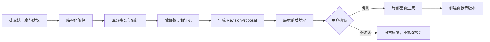

# 反馈与报告修订

- Status: Accepted
- Owner: Project
- Last reviewed: 2026-09-23
- Scope: 定义用户对报告的认同度、调整建议、解释确认、修订和调优闭环；不定义评测执行引擎或数据库表结构。
- Related ADRs: ADR-0001

## 1. 反馈目标

每份日报、周报、月报、完整公司报告和最新研究观点都必须允许用户反馈。反馈有三个目的：

1. 发现客观事实、计算、检索、引用和表达问题；
2. 记录用户认可或不认可的分析逻辑；
3. 把代表性问题转化为修订任务和固定评测案例。

认同度反映用户是否认可分析逻辑，不等于报告客观正确性，也不能直接改变数据事实。

## 2. 认同度

每份报告支持五级整体认同度：

- 完全不认同；
- 不太认同；
- 部分认同；
- 比较认同；
- 完全认同。

用户还可以分别评价经营质量、成长质量、财务稳健性、估值逻辑、风险判断、证据完整度和结论强度。

认同度必须绑定 `reportId` 和 `reportVersion`，可进一步绑定章节或具体结论；后续修订不能把原反馈迁移成对新版本的默认评价。

## 3. 修改与调整建议

系统提供结构化快捷标记和自由文本：

- 数字错误；
- 信息遗漏；
- 引用不足或引用不匹配；
- 财务或估值口径问题；
- 同行选择不合理；
- 风险判断偏差；
- 结论强度不合适；
- 表达结构或可读性问题；
- 研究方法或观察重点建议。

反馈目标可以是整份报告、章节、结论、数字、图表或引用。每条反馈保存目标定位、用户原文、提交时间和关联报告版本。

## 4. 反馈解释

模型把自然语言反馈解析为 `FeedbackInterpretation`，输出：

- 反馈目标和定位；
- 问题类型；
- 用户主张；
- 建议修改；
- 是否需要重新查询数据或验证证据；
- 可能受影响的其他章节；
- 解释置信度。

系统先展示解释结果，存在歧义时请用户确认。不能在用户尚未确认目标时直接覆盖报告或写入长期偏好。

反馈必须区分：

| 类型 | 处理原则 |
| --- | --- |
| 客观事实或数字错误 | 重新查询、计算和验证，不能按偏好修改 |
| 引用与证据问题 | 重新检索并验证原文位置 |
| 分析方法建议 | 展示调整方案和影响范围 |
| 主观研究偏好 | 明确确认后写入可见、可修改、可删除的偏好 |
| 纯表达建议 | 不改变事实和结论强度的前提下局部改写 |

## 5. 报告修订流程



反馈状态为：

```text
RECEIVED → INTERPRETED → VERIFYING → REVISION_PROPOSED
REVISION_PROPOSED → USER_APPROVED → APPLIED
```

异常或终止状态包括 `REJECTED`、`INSUFFICIENT_EVIDENCE` 和 `CONVERTED_TO_EVAL_CASE`。

修订默认只重跑受影响章节及其依赖校验。若反馈揭示研究基线、核心数据或全局假设错误，则创建新的完整研究任务，而不是在旧文本上局部修补。

## 6. 领域对象

- `ReportFeedback`：用户提交的原始反馈、认同度和版本关系；
- `FeedbackTarget`：报告、章节、结论、数字、图表或引用定位；
- `FeedbackInterpretation`：模型结构化解释及其置信度；
- `RevisionProposal`：修改内容、依据、影响范围和执行计划；
- `ReportRevision`：新旧报告版本及差异；
- `ResearchPreferenceProfile`：用户明确确认的研究偏好。

领域边界和不变量由 [领域模型](../architecture/domain-model.md) 维护。

## 7. 版本与审计

- 原报告及其 PDF 永不覆盖；
- 每次修订生成新的 `reportVersion` 和变更摘要；
- 保存修改原因、关联反馈、验证结果、执行节点和操作者；
- 用户可以查看新旧版本差异并回到旧版本；
- 偏好变更具有历史，可由用户查看、修改和删除；
- 自动修订不得绕过数字、引用和证据质量门禁；
- 被拒绝的建议仍保留审计记录，但不影响正式报告。

## 8. 反馈进入评测和调优

问题先归因为：

1. 数据获取或确定性计算；
2. 文档解析、检索或重排；
3. Prompt 与结构化输出；
4. 模型能力或模型路由；
5. 工作流、工具或质量门禁；
6. 产品表达和交互。

代表性问题转为冻结输入和明确期望的固定评测案例。修改在离线评测和历史样本回归通过后，进行影子运行和人工对比，再小范围启用。单用户场景不做随机线上 A/B 测试。

长期质量不能只以股价涨跌评价，还要观察：

- 当时已公开的重要信息是否被遗漏；
- 风险是否被及时识别；
- 证伪条件是否明确且有效；
- 观点是否随着新事实及时变化；
- 估值逻辑是否与后续基本面相符；
- 相同问题是否在 Prompt、模型或 RAG 调整后复发。

评测门禁和指标的技术定义见 [可观测性与评测](../architecture/observability-and-evals.md)。
